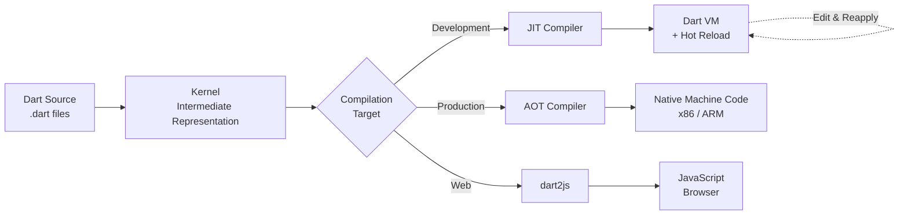
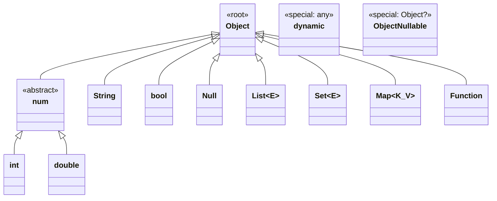
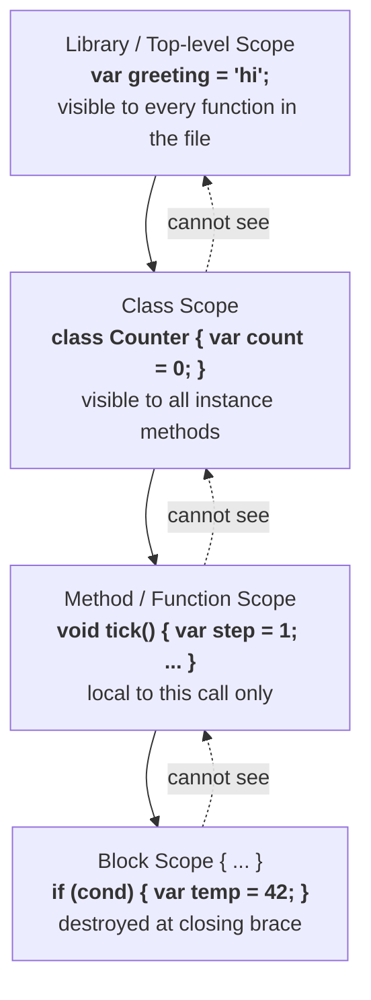
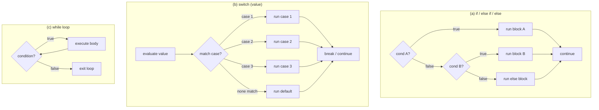
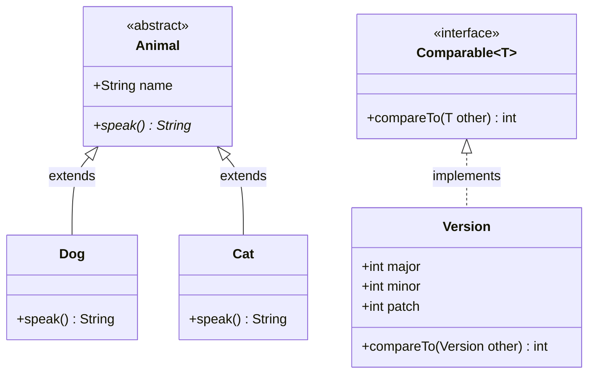
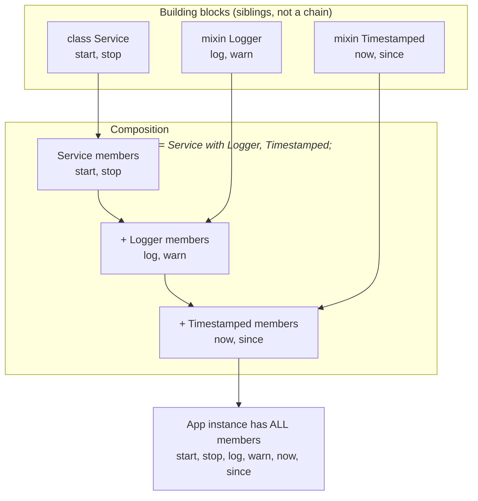
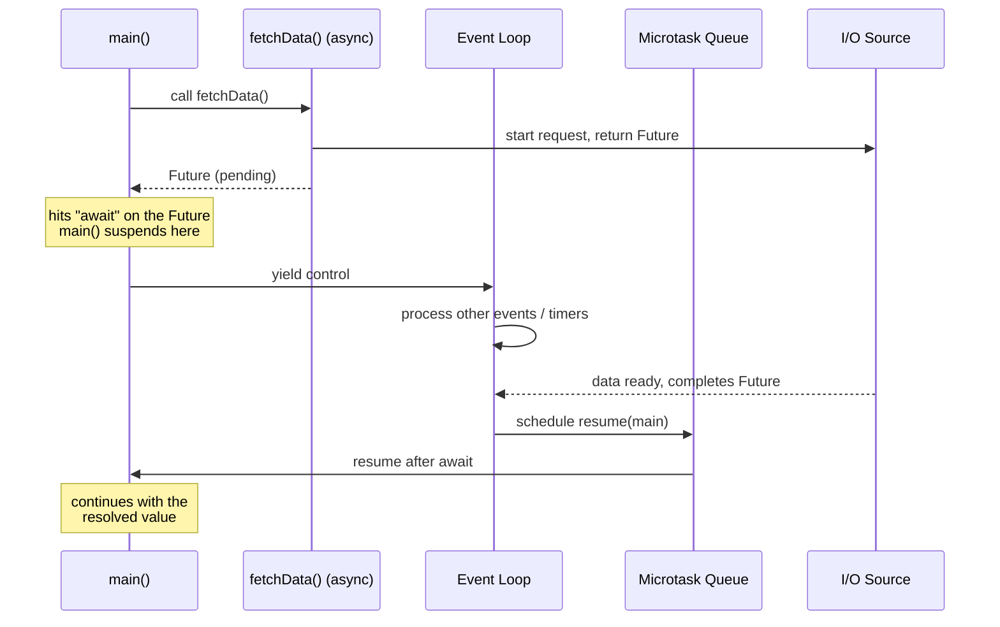
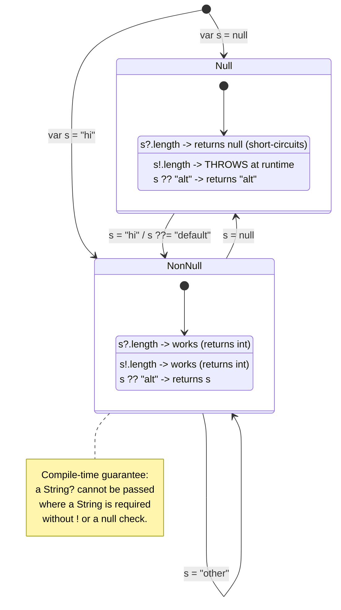

# Dart Tutorial — Visual Diagrams

This document contains 10 diagrams used as visual aids in the Dart programming language video tutorial. Each diagram is paired with the slide it appears on, the rendering format, and a teaching-oriented caption.

---

## Diagram 1 — Dart Compilation Pipeline
**Used in slide:** S3
**Type:** Mermaid



**Caption:** Dart's three-way compilation pipeline lets the *same* source code target a fast development loop (JIT with hot reload), maximally optimized native binaries (AOT for mobile/desktop/server), or the web (dart2js). Understanding which stage runs when explains why Flutter feels instant in debug yet fast in release.

---

## Diagram 2 — Type Hierarchy
**Used in slides:** S9 and S11
**Type:** Mermaid



**Caption:** Every non-nullable Dart value descends from `Object`; numeric types share the `num` super-type so `int` and `double` interoperate without explicit casts. `dynamic` opts out of static checking entirely, while `Object?` is the safe "could be anything, including null" alternative — pick `Object?` unless you genuinely need to bypass the type system. *(Note: `Map<K_V>` in the diagram represents the Dart type `Map<K, V>` — the underscore is a Mermaid syntax workaround.)*

---

## Diagram 3 — Variable Scope Flowchart
**Used in slide:** S8
**Type:** Mermaid



**Caption:** Dart resolves names from the innermost scope outward, so a `var` declared in a block is invisible to its enclosing method, and a method-local `var` is invisible at class level. Knowing which scope owns a name prevents accidental shadowing and helps you decide where to declare each variable.

---

## Diagram 4 — Control Flow Flowchart
**Used in slides:** S13 / S14
**Type:** Mermaid



**Caption:** The three pillars of imperative control flow: `if` chains pick *one* branch from many tests, `switch` dispatches on a single value with a default fallback, and `while` repeats until its guard goes false. Visualizing the diamonds (decisions) versus rectangles (work) makes it obvious why infinite loops happen — the condition never flips.

---

## Diagram 5 — Pass-by-Value-of-Reference Memory Diagram
**Used in slide:** S16
**Type:** ASCII art

```
   STACK                                        HEAP
   ===============                              =================================
                                                
   Caller frame:                                +------------------------------+
   +-------------------+                        |  List object @0xA1           |
   |  xs  --[ref]----------------------------+->|  +------+------+------+      |
   +-------------------+                     |  |  |  1   |  2   |  3   |     |
                                             |  |  +------+------+------+      |
                                             |  +------------------------------+
   --- mutate(xs) called -------------------- |
                                             |
   Callee frame:                              |
   +-------------------+                      |
   |  xs  --[ref]------------------------------+   (same target!)
   +-------------------+

   ----------------------------------------------------------------------------

   Effect of operations inside mutate(xs):

     xs.add(99);             writes through the reference
                             ==> Caller sees [1, 2, 3, 99]   (SHARED OBJECT)

     xs = [7, 8, 9];         only rebinds the LOCAL slot in the callee frame
                             ==> Caller's xs still points to [1, 2, 3, 99]

   ----------------------------------------------------------------------------
   KEY: the ARROW (reference) is copied on the call;
        the BOX it points to is not.
```

**Caption:** Dart passes the *reference itself* by value — the caller and callee end up with two copies of the same arrow into the heap. Mutating through either arrow is visible to both, but reassigning the parameter only swaps the callee's local arrow, which is the single most common source of "why didn't my function update my list?" bugs.

---

## Diagram 6 — OOP UML Class Diagram
**Used in slides:** S18-S20
**Type:** Mermaid



**Caption:** UML conventions make Dart's three OOP relationships visible at a glance: solid arrows for `extends` (inheritance of behavior), dashed arrows for `implements` (contract only), and italicized members for `abstract`. The `Animal` hierarchy demonstrates polymorphism via overriding, while `Version` shows how any class can satisfy a generic interface like `Comparable<T>`.

---

## Diagram 7 — Mixin Composition Diagram
**Used in slide:** S25
**Type:** Mermaid



**Caption:** A mixin is *applied* to a class, not inherited from — `class App = Service with Logger, Timestamped` stitches three independent member sets into one type without forcing `Logger extends Service`. This avoids the deep brittle hierarchies that single-inheritance languages fall into when they want to reuse cross-cutting behavior.

---

## Diagram 8 — Future / Async Timeline
**Used in slide:** S24
**Type:** Mermaid



**Caption:** `await` does not block a thread — it returns control to the event loop so other work runs while the Future is pending, then the microtask queue resumes the suspended function the instant the Future completes. This single-threaded cooperative model is why Dart UI code stays responsive without locks or extra threads.

---

## Diagram 9 — Sound Null Safety State Diagram
**Used in slide:** S23
**Type:** Mermaid



**Caption:** A `String?` lives in exactly two states, and Dart's null-safe operators do different things in each: `?.` short-circuits in the Null state, `!` only succeeds in NonNull, `??` substitutes a fallback when Null, and `??=` assigns only when Null. Because the *type* `String?` is distinct from `String`, the compiler refuses unsafe assignments before your program ever runs.

---

## Diagram 10 — Records & Patterns Destructuring Sketch
**Used in slide:** S26
**Type:** ASCII art

```
   Step 1 — A record is a small, fixed-shape, anonymous tuple
   ----------------------------------------------------------------
   final record = (42, 'hello');     // type: (int, String)

       record  -->  +-------+-----------+
                    |  42   |  'hello'  |
                    +-------+-----------+
                       $1        $2


   Step 2 — Destructuring binds positions to fresh names
   ----------------------------------------------------------------
   final (n, s) = record;

           +------+               +-----------+
       n = |  42  |           s = |  'hello'  |
           +------+               +-----------+
              ^                        ^
              |   ........extracted from record fields........
              |                        |
              +------- $1              +------- $2


   Step 3 — Pattern matching captures and tests at the same time
   ----------------------------------------------------------------
   switch (record) {
     case (0, _)        => print('zero, ignored');
                                ^
                                | wildcard: matches anything,
                                  no binding

     case (var n, _)    => print('non-zero n=$n');
                  ^^^^^
                  |
                  +-- CAPTURE: introduces a new local `n`
                      bound to whatever was in position $1

     case (var n, var s) when n > 0
                        => print('$s repeated $n times');
                                                ^^^^^^^
                                                |
                                                +-- guard: extra
                                                    boolean test
   }

   Brackets meaning:
     ( ... , ... )   record / tuple shape (must match arity)
     _               wildcard (no binding)
     var name        capture into a new variable
     when expr       optional guard tested after the shape matches
```

**Caption:** Records pack multiple values into one anonymous shape; destructuring and `switch` patterns then *unpack* them by position in a single readable line, replacing chains of `record.$1` accesses and nested `if` checks. The same `(var n, _)` syntax both *tests* the shape and *binds* the parts, which is what makes pattern matching feel concise instead of verbose.

---

*End of diagrams (10 total).*
